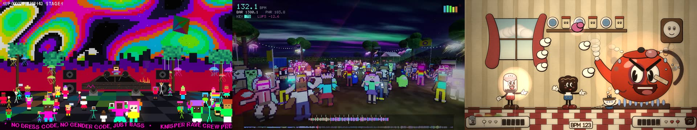
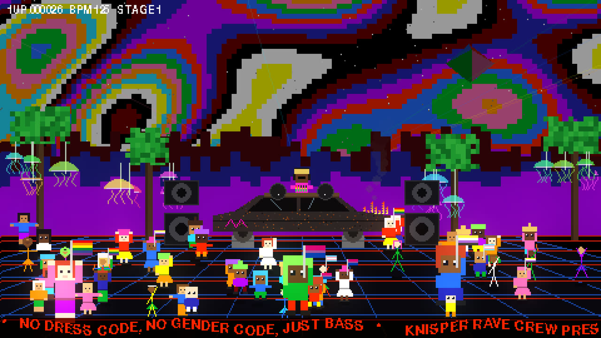
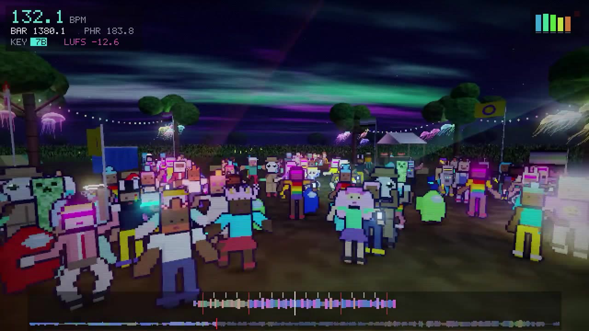
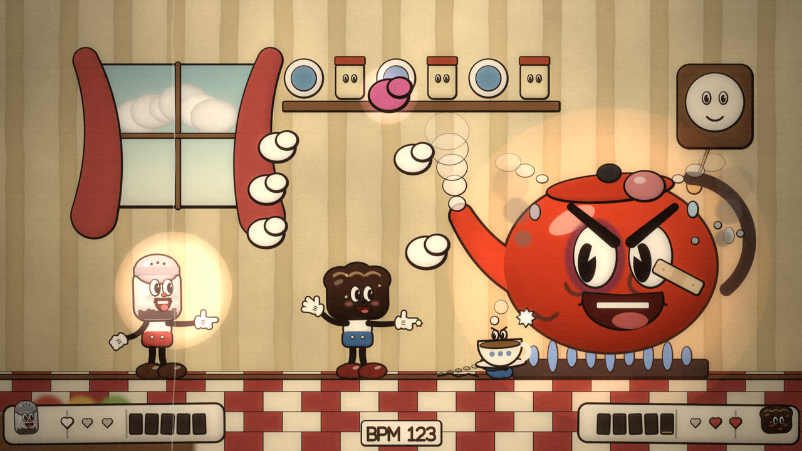
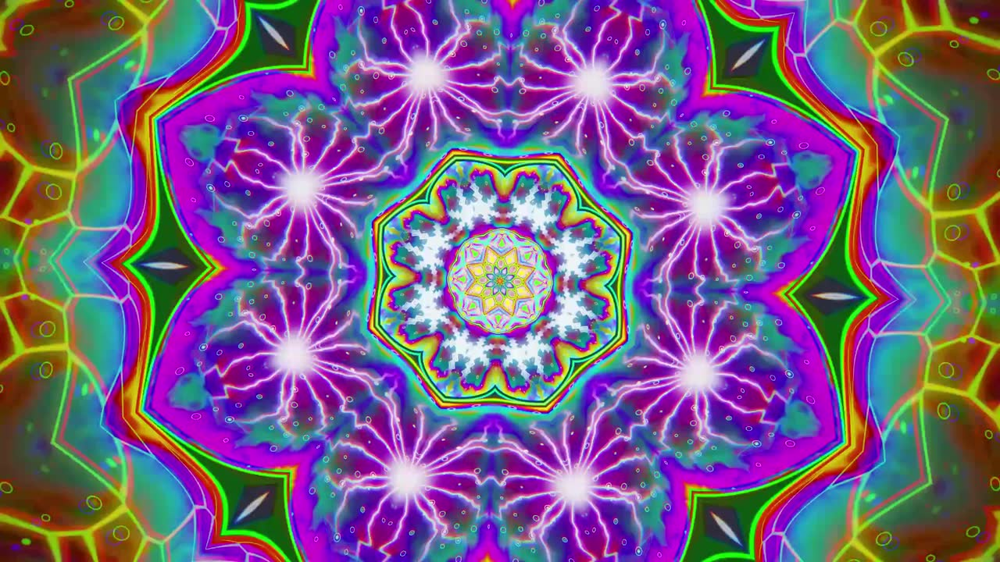
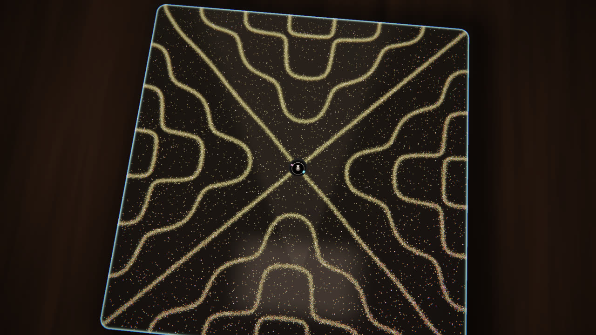
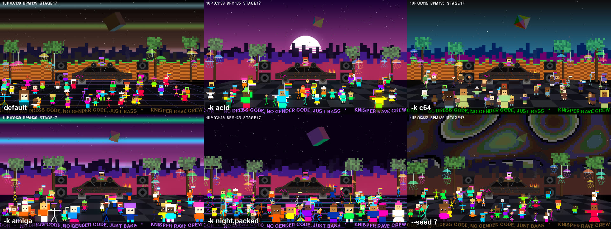
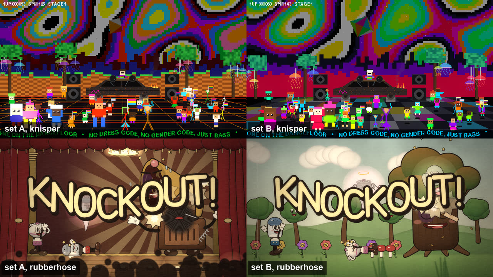
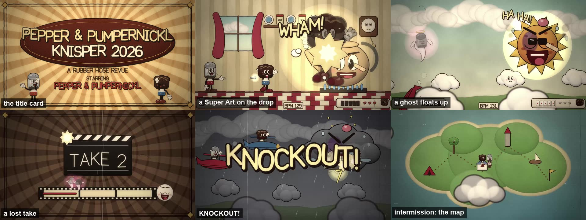
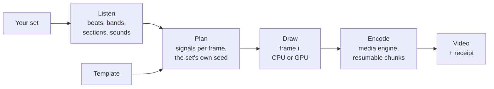

<p align="center">
  
</p>

<h1 align="center">setrender</h1>

<p align="center">
  <b>Your DJ set, as a music video that dances to it.</b><br>
  Give it a WAV or AIFF, pick a world, and get a YouTube-ready video where every kick, hi-hat, breakdown and drop moves something on screen.
</p>

<p align="center">
  <a href="#watch-it">Watch</a> ·
  <a href="#try-it-in-five-minutes">Quick start</a> ·
  <a href="docs/templates/README.md">Gallery</a> ·
  <a href="docs/cookbook.md">Cookbook</a> ·
  <a href="docs/how-it-works.md">How it works</a> ·
  <a href="CONTRIBUTING.md">Contributing</a>
</p>

<p align="center">
  
  
  
  
  <a href="LICENSE"></a>
  <a href="docs/criteria/README.md"></a>
</p>

---

## Five worlds, one command

<table>
  <tr>
    <td width="20%"><a href="docs/templates/knisper.md"></a></td>
    <td width="20%"><a href="docs/templates/cropcircle.md"></a></td>
    <td width="20%"><a href="docs/templates/rubberhose.md"></a></td>
    <td width="20%"><a href="docs/templates/spume.md"></a></td>
    <td width="20%"><a href="docs/templates/cymatics.md"></a></td>
  </tr>
  <tr>
    <td><b><a href="docs/templates/knisper.md">knisper</a></b><br>An 8-bit underground rave. A burned-out car is the DJ booth, jellyfish hang in blocky trees, and a crowd of every kind bounces on a lit dancefloor, with nods to the C64, Amiga, Mega Drive, N64 and NES.</td>
    <td><b><a href="docs/templates/cropcircle.md">cropcircle</a></b><br>A night at a farm festival, seen first-person in 3D, from sunset to sunrise. UFOs lay crop circles, a drone flies the fields, people arrive through the corn, dance, queue for the loos and go home.</td>
    <td><b><a href="docs/templates/rubberhose.md">rubberhose</a></b><br>A 1930s rubber-hose cartoon boss rush with original characters. One boss per act, hearts, ghosts, lost takes, super attacks on the drops, intermissions in the breakdowns and an easter egg every minute.</td>
    <td><b><a href="docs/templates/spume.md">spume</a></b><br>Alien foam, falling forever into itself. Bubbles inside bubbles in the colours of real soap films, kaleidoscopes fading in and out, and fire, water, earth, air, metal, ice, lightning and magma in alternating bubbles. No characters, no letters.</td>
    <td><b><a href="docs/templates/cymatics.md">cymatics</a></b><br>Sound made visible. A physics lab at night, filmed in macro: sand on a Chladni plate, Faraday waves, ferrofluid spikes, a Rubens tube of flames, water frozen by a strobe and lasers drawing the chord of the key, all played by the set.</td>
  </tr>
</table>

Everything on screen answers to the music: the beat tracker finds every kick, five frequency bands drive different things on screen, the set's sections change the scenery, and the drops land. The same set always renders the same video, and two different sets never look alike.

## Watch it

<table>
  <tr>
    <td width="33%"><a href="https://youtu.be/JZnURn199K0"></a></td>
    <td width="33%"><a href="https://youtu.be/d__gZC1iRnI"></a></td>
    <td width="33%"><a href="https://youtu.be/DOuO45YCyCs"></a></td>
  </tr>
  <tr>
    <td>▶ <b><a href="https://youtu.be/JZnURn199K0">30 seconds of rubberhose</a></b><br>A trailer for the boss rush, cut by <code>setrender reel</code> with every cut on a beat.</td>
    <td>▶ <b><a href="https://youtu.be/d__gZC1iRnI">Two minutes of rubberhose</a></b><br>One clip per boss on its best moment, from <code>setrender reel --per-act --length 120</code>.</td>
    <td>▶ <b><a href="https://youtu.be/DOuO45YCyCs">The whole set in cropcircle</a></b><br>Pepper &amp; Pumpernickl at Knisper Festival 2026, from sunset to sunrise.</td>
  </tr>
</table>

All three were rendered by setrender from the same DJ set. Watch with the sound on: every kick, drop and breakdown is doing something.

## Try it in five minutes

You need a Mac with Apple Silicon, [Homebrew](https://brew.sh) and a DJ set as WAV or AIFF.

```bash
brew install uv git
git clone https://github.com/dnk8n/setrenderer.git && cd setrenderer
./install.sh
```

Render a 30-second preview from ten minutes into your set (tip: type the command, then drag your audio file into the Terminal window to paste its path):

```bash
.venv/bin/setrender render "my set.wav" --start 600 --duration 30
open out/
```

Happy with it? Drop `--start` and `--duration` to render the whole set. A two-hour set takes about 40 to 65 minutes on an M1 Pro, keeps the machine responsive, and picks up where it left off if you stop it.

New to the Terminal? **[Getting started](docs/getting-started.md)** walks through every step, including uploading to YouTube.

## A taste of what you can ask for

```bash
setrender render set.wav -t rubberhose                          # the cartoon boss rush
setrender render set.wav -t cropcircle -k aurora,packed         # keywords switch on looks
setrender render set.wav -t spume -k mirror,acid                # psychedelic foam, kaleidoscopes all night
setrender render set.wav -t cymatics -k plates                  # sand, waves and ferrofluid played by the set
setrender render set.wav -k acid --seed 3                       # another take on the same set
setrender render set.wav --set elements.crowd.count=80          # change any value in a template
setrender still  set.wav -t rubberhose --at 60,600,3600         # snapshots before you commit
setrender reel   set.wav -t rubberhose --per-act --length 30    # a beat-cut trailer, one clip a boss
setrender render set.wav --resolution 2160p --audio-codec aac   # 4K, as a small MP4
setrender render set.wav --cpu 4                                # stay gentle while you work
```

(Inside the repo folder, `setrender` is `.venv/bin/setrender`, or run `source .venv/bin/activate` once.)

<p align="center">
  <br>
  <sub>The same second of the same set in knisper: the default, four keyword looks, and <code>--seed 7</code>.</sub>
</p>

The **[cookbook](docs/cookbook.md)** has a recipe for each of these and more: highlight reels, 4K, lossless masters, batch renders, reproducing a render from its receipt, and checking a video against the criteria.

## Every set looks like itself

<p align="center">
  <br>
  <sub>Two different 30-second test sets (cut from different hours of a mix), same templates, same moment, no settings changed.</sub>
</p>

The variation seed is built from the audio itself, so palettes, crowds, stages, casts and running orders differ from set to set, while the set's tempo, key, energy and structure drive the motion. Render the same set twice and you get the same video, frame for frame. Want a different take? Change `--seed`.

## Hidden in the videos

Things to look out for, without spoiling all of them:

- a cow with a cowbell, but only when Apple's on-device sound classifier actually hears a cowbell in your set (cropcircle)
- the Konami code at bar 1337, and someone missing at bar 404 (cropcircle)
- a skeleton playing its ribs at bar 1929 and a steamboat at bar 1928, for the cartoons of those years (rubberhose)
- a film burn at bar 404, a ghost when it hears a theremin, and 26 kinds of easter egg, about one a minute and never the same one twice in ten minutes (rubberhose)
- thirteen bosses, from a gramophone in a ballroom to a pig DJ who turns into a dragon (rubberhose)
- light that changes colour with the key of the music, around the circle of fifths, and bubbles that blaze when the classifier hears their instrument: brass sets fire to them, keys turn them to water, bells to bismuth (spume)
- sand that settles on the nodal lines of a harmonic of your set's key, by Chladni's law, and three lasers drawing the key's chord, major or minor (cymatics)

<p align="center">
  
</p>

The full lists are on each [template's page](docs/templates/README.md).

## How it works, in one picture



- **Free and local.** ffmpeg, librosa, NumPy/SciPy, pygame-ce and wgpu, all open source and all on your machine. Nothing is uploaded anywhere.
- **Deterministic.** Each frame depends only on its number, the audio and the settings, so renders are reproducible, parallel and exact to the frame.
- **Kind to your computer.** `--cpu` caps the load the render adds (7 by default on an 8-core Mac), frames are drawn on the GPU where the template allows, and the hardware encoder does the compression.
- **Resumable.** Work is saved in one-minute chunks. Stop it, reboot, run the same command, and it carries on.
- **Measured, not eyeballed.** What "done" means is written down as criteria, and scripts check each one. The templates in the box pass all of their automated checks.

Read **[how it works](docs/how-it-works.md)** for the full pipeline.

## Go deeper

| I want to... | Read |
|---|---|
| install it and make my first video, step by step | [Getting started](docs/getting-started.md) |
| see every template and what to look out for | [Templates](docs/templates/README.md) |
| find a recipe for a specific task | [Cookbook](docs/cookbook.md) |
| look up a command, an option or an output file | [Reference](docs/reference.md) |
| understand the pipeline and why it is built this way | [How it works](docs/how-it-works.md) |
| make my own template | [Make a template](docs/make-a-template.md) |
| know what "complete" means and how it is checked | [Criteria](docs/criteria/README.md) |
| fix a bug, add a feature or a whole new engine | [Contributing](CONTRIBUTING.md) |
| point my coding agent at this repo | [AGENTS.md](AGENTS.md) |

## Make it yours

A template is a plain YAML file: palettes, which frequency band drives which element, how many people are in the crowd, which bosses fight, and keywords that bundle a look. Copy one, change it, and render with `-t path/to/yours.tpl`. When YAML is not enough, a new engine is a Python module that draws frame *i*. [Make a template](docs/make-a-template.md) shows both.

## Contributing

Ideas for new worlds, bug reports, docs fixes and code are all welcome, and so are contributions made with AI coding agents, as long as a person stands behind them. Start with **[CONTRIBUTING.md](CONTRIBUTING.md)**. Agents can read **[AGENTS.md](AGENTS.md)**, which most coding agents pick up on their own.

## Requirements

| | |
|---|---|
| Tested on | macOS on Apple Silicon (M1 Pro, 16 GB) |
| Other systems | untested; `knisper` with `--encoder x264` is the likeliest to work, and the sound-cued gags need macOS |
| Disk | about 10 to 20 GB per two hours of 1080p60 at the default quality; the render checks before it starts |
| Time for a 2 h set | about 40 min (knisper), 60 min (cropcircle), 65 min (rubberhose), 65 min (spume) or 55 min (cymatics) on an M1 Pro |
| Installs | ffmpeg (Homebrew), [uv](https://docs.astral.sh/uv/), and pinned Python packages in a local `.venv` |

## Credits

Built on the shoulders of [ffmpeg](https://ffmpeg.org), [librosa](https://librosa.org), [NumPy](https://numpy.org), [SciPy](https://scipy.org), [pygame-ce](https://pyga.me), [wgpu-py](https://github.com/pygfx/wgpu-py) and Apple's on-device [SoundAnalysis](https://developer.apple.com/documentation/soundanalysis) classifier. rubberhose is a love letter to 1930s rubber-hose animation and to the games it inspired; its characters, stages and lettering are original.

## License

setrender is released under the [MIT License](LICENSE): use it, change it, build on it and ship what you make, commercially or not, as long as the copyright notice comes along. The videos you render from your own music are yours.

The tools it runs on keep their own licenses (ffmpeg is LGPL/GPL and installed separately through Homebrew, pygame-ce is LGPL, and librosa, NumPy, SciPy and wgpu-py use permissive licenses).
