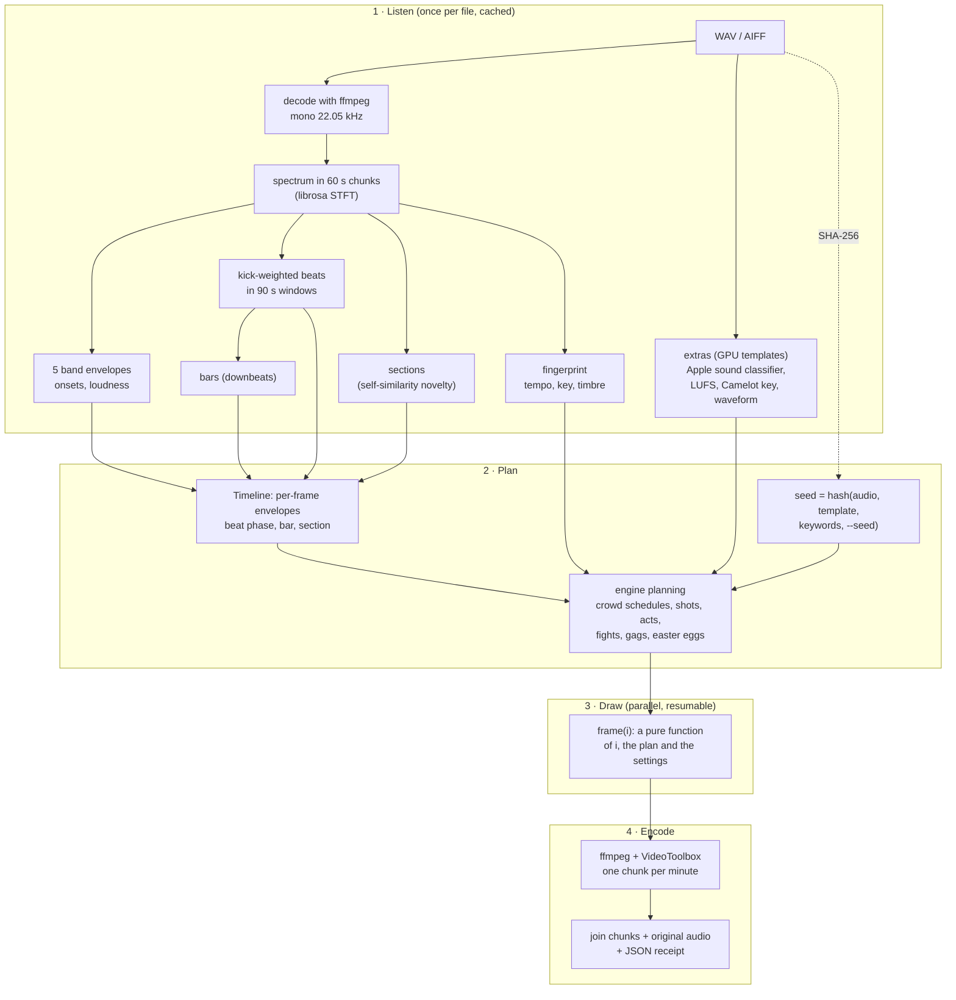

# How it works

setrender is a small pipeline glued together from well-tested open-source tools. This page follows a set through it, then explains the design choices that make renders reproducible, resumable and measurable. It is the background you want before [making a template](make-a-template.md) or [contributing](../CONTRIBUTING.md).

## 1. Listen

The audio is decoded with ffmpeg (soxr resampling) to mono at 22.05 kHz and analysed in 60-second chunks, so a three-hour set needs no more memory than a short one (about 2 GB at peak, 18 seconds for two hours on an M1 Pro).

- **Bands.** The spectrum is split into five bands: sub (20 to 90 Hz), bass (90 to 250 Hz), low mids (250 Hz to 1 kHz), high mids (1 to 4 kHz) and highs (4 to 11 kHz). Each band's energy is normalised against its own local floor and ceiling over about 12 seconds, so quiet intros and loud peaks both move the picture, while the dynamics inside a passage survive.
- **Onsets and loudness.** Spectral flux on a short window gives precise onset timing; overall loudness drives slower changes like colour.
- **Beats.** DJ sets are carried by the kick, so beat tracking runs on a kick-weighted onset envelope (energy rising below 150 Hz, plus a little general onset strength). It runs in 90-second windows with overlap, which follows tempo drift across a mix, uses a tempo prior around club tempo so sparse passages don't halve or double, then moves each beat to the exact peak of the envelope and smooths the grid over its neighbours to remove jitter from hats and snares. On a 128 BPM click track the median beat error is 1.1 ms.
- **Bars.** Downbeats are the phase of every fourth beat with the most energy in the first band (the sub).
- **Sections.** A self-similarity matrix of one-second timbre and harmony summaries, with a checkerboard novelty curve, finds where the music changes. Section starts snap to the nearest downbeat.
- **Fingerprint.** Tempo, key, the average chroma, spectral centroid, the level of each band, dynamic range and onset density: a compact description of what makes this set this set.

The result is cached in `~/.cache/setrender` under a key made from the audio's SHA-256 and the analysis settings, so it never runs twice for the same file.

The GPU templates also run an **extras** pass over the whole set: Apple's built-in SoundAnalysis classifier (Core ML, on-device, Neural Engine capable) labels 303 kinds of sound every 1.5 seconds, plus loudness in LUFS (ITU BS.1770 K-weighting), the key per window in Camelot notation, and a three-band waveform for the HUD. That takes about 50 seconds for two hours and is cached too. Off macOS the classifier is skipped and the sound-cued gags simply don't happen.

## 2. Plan

**The timeline** turns the analysis into one value per video frame for everything an element can listen to: each band's envelope with its own attack and release (from the template's `smoothing:` block), the beat envelope and phase, the bar, the section and its energy. A beat shows on the frame whose display interval contains it, which is how the picture lands on the beat to the frame.

**The seed** is a hash of the audio's SHA-256, the template name, the keywords and `--seed` (and, for crucible, the run number). Everything random in a render comes from it. That one choice gives both of the properties people care about: the same inputs always give the same video, and different sets always look different.

**Engine planning** is where templates differ. knisper picks palettes, sky and floor styles per section and builds its crowd. cropcircle writes schedules for 110 people (arrive, dance, queue, sit, leave), cuts camera shots on phrases and drops, and places events by structure, sounds and bar numbers. rubberhose plans the whole cartoon up front: acts at section starts, takes, boss phases, every shot and its outcome, intermissions in the breakdowns and an easter egg every minute. spume plans its motifs by section, its kaleidoscopes by phrase and its pops by drop, and integrates the dive into the recursion, the camera's turn and the films' swirl over the whole set, so any frame knows how far the camera has fallen. cymatics plans a station per section and a mode per phrase from a harmonic of the key's root, with sweeps in the builds, overdrives on the drops and rest in the breakdowns, and integrates the camera's orbit and the patterns' drift over the whole set. crucible matches each stretch of the set to one of twenty trials (an assignment over the whole set), builds each trial's world from that stretch's music, and then, unlike the others, runs real optimisers before drawing anything: every chapter is evolved as a series of runs (journeys to success, harder worlds, dead ends) and cached, so each round replays a recorded genome exactly. Its run number is drawn fresh for every new render and recorded in the receipt.

## 3. Draw

Every frame is a **pure function of its index**: `frame(i)` reads the plan and the timeline at `i` and draws, with no state carried from frame to frame. This is the design choice everything else rests on:

- frames can be drawn in any order, so chunks render in parallel processes,
- an interrupted render resumes anywhere and matches an uninterrupted one bit for bit,
- a slice of a rubberhose, spume, cymatics or crucible render (which plan in absolute set time) is exactly those frames of the full render, which is what makes reels and previews cheap,
- determinism is testable: render twice, compare frame hashes.

There are six engines, chosen by a template's `engine:` key:

| Engine | Used by | How it draws |
|---|---|---|
| `pixel` (default) | knisper | pygame-ce surfaces at 480x270, scaled up by whole pixels in ffmpeg, with CRT scanlines |
| `cropcircle` | cropcircle | wgpu (WebGPU on Metal): supersampled HDR 3D, instanced corn, pixel-art billboards, volumetric beams, fog, bloom, ACES tone mapping and a 5-bit ordered dither, at 640x360 |
| `rubberhose` | rubberhose | wgpu: signed-distance shapes on instanced quads at the output resolution, ink and paint shading, line boil on a 24-drawings-per-second clock locked to the beat, a film-print pass, and BT.709 NV12 conversion on the GPU |
| `spume` | spume | wgpu: one full-screen WGSL shader per frame at the output resolution: recursive foams (power diagrams, Möbius maps, hyperbolic reflections, log-polar spirals), soap films coloured from a spectral thin-film interference table, eight procedural elements, bloom, and BT.709 NV12 conversion on the GPU |
| `cymatics` | cymatics | wgpu: one full-screen WGSL shader per frame at the output resolution: sand grains on a Chladni plate's nodal lines, analytic Faraday waves, a ray-marched ferrofluid height field, flames and water in a plane under a perspective camera, Lissajous figures solved per pixel, lit by an analytic studio; depth of field and a rack focus from a per-pixel circle of confusion, bloom, and BT.709 NV12 conversion on the GPU |
| `crucible` | crucible | the evolution first (NumPy simulations, with pycma, pyribs, neat-python and DEAP), then wgpu at the output resolution: 4x multisampled HDR, instanced 3D meshes with a sun shadow map and per-frame soft-body triangle soups, 2D triangles and signed-distance shapes, a 320x180 pixel-art layer scaled up by whole pixels, a signed-distance text overlay laid over the graded picture, bloom, and BT.709 NV12 conversion on the GPU |

## 4. Encode

Each chunk (60 seconds by default) is piped as raw frames into its own ffmpeg process and written to a temporary file, then renamed into place only when complete. The chunk folder holds a manifest of the settings; if you rerun with different settings, setrender refuses to mix chunks unless you pass `--restart`.

The default encoder is Apple's media engine through VideoToolbox: H.264 High, 4:2:0, BT.709, a closed GOP of half a second, no B-frames, and faststart, which is YouTube's recommended upload format, at almost no CPU cost. Finally the chunks are joined without re-encoding and muxed with the original audio, untouched: PCM at the source's own bit depth, sample-identical to the input.

### The CPU budget

`--cpu N` is the load average the render may add. Each parallel job is one Python renderer plus an ffmpeg process, so the budget is divided into jobs: about 2.5 load per job with the hardware encoder, 2.2 for GPU templates (the GPU does the pixel work), and with the software encoder a single job with the rest of the budget as encoder threads. Numeric libraries are pinned to one thread each so nothing oversubscribes behind the budget's back, and `--nice 10` keeps the render polite. On an 8-core M1 Pro, the full renders in the criteria reports (at `--cpu` 5 to 7) peaked at a one-minute load of 5.6 to 6.3.

## The receipt

Every render writes `<output>.json`: the audio's path, SHA-256, format and duration; the analysis summary; every resolved template value; the CPU, encoder and seed settings; ffmpeg, Python and library versions; the GPU adapter and sound classifier; and a `reproduce` command. Running that command again produces the same video frame for frame, which the criteria check.

## Variation, in detail

A set's look is decided by three things together:

1. **The audio.** Its hash seeds the variation; its key rotates the starting palette (knisper); its tempo, energy and sections drive the motion and the structure.
2. **The template and keywords.** Keywords change values, and because they are part of the seed, they also reshuffle.
3. **`--seed`.** The same set with a different seed is a different, equally repeatable take.

The criteria measure it: the colour-histogram distance between two different sets is well above the threshold (0.95 to 1.25), and the same set rendered twice measures 0.0.

## Measured, not eyeballed

What "done" means is written down before the work starts, as criteria in [docs/criteria](criteria/README.md). Each criterion is either automated (a script measures it on real renders: beat sync to the frame, sample-identical audio, determinism, resume, load, the template's own rules) or a human checklist item (does it feel like a 1930s cartoon?). The scripts in `tests/` run the automated ones and write a JSON report, and each template has a report of its latest full run. This is also how changes are judged: a change is finished when its criteria pass, not when it looks finished.
