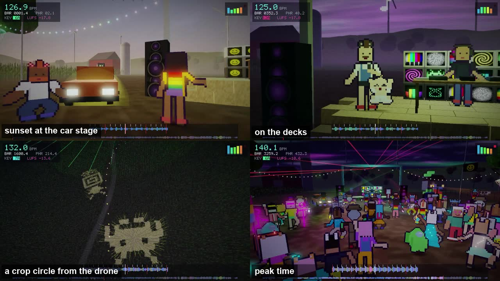
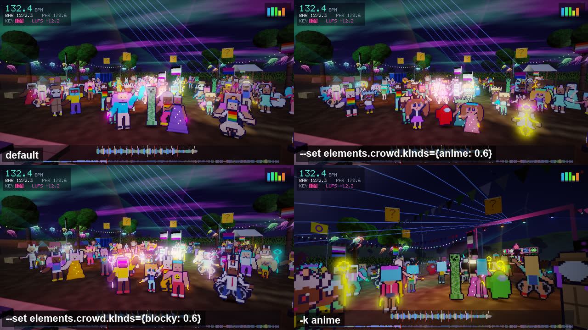

# cropcircle: a night at a farm festival

<p align="center"></p>

A first-person night at an outdoor festival on a farm, from sunset to sunrise. The camera walks the dancefloor, dances, crowd-surfs and flies an FPV drone over crop circles that appear through the night. Jellyfish hang in the trees and blow in a wind that gusts on the beat. A parked car is part of the DJ stage and its headlights pump with the kick. People arrive through the corn, dance, queue for the loos and leave, and flags come and go.

```bash
setrender render set.wav -t cropcircle
setrender render set.wav -t cropcircle -k aurora,packed
```

<p align="center"><a href="https://youtu.be/DOuO45YCyCs"></a><br>
▶ <b><a href="https://youtu.be/DOuO45YCyCs">Watch the whole Knisper set in cropcircle</a></b>, sunset to sunrise.</p>

It is drawn in 3D on the GPU in an HD-2D style: low-poly farm, 30,000 instanced corn plants and pixel-art people as billboards, at 640x360, upscaled three times to 1080p.

<p align="center"></p>

## Under the hood

| Stage | Tool | Notes |
|---|---|---|
| Extra analysis | Apple SoundAnalysis built-in classifier (Core ML, on-device; Neural Engine capable), librosa, SciPy | 303 sound classes every 1.5 s (cowbell, theremin, sax, vocals, scratching, laughter, phones...), LUFS (BS.1770 K-weighting), key per window in Camelot notation, 3-band waveform. One pass, about 50 s for a 2 h set, cached next to the analysis. |
| Scene | wgpu (WebGPU, Metal backend) | supersampled HDR 3D: instanced corn (30k plants) with crop circles laid in the vertex shader, low-poly farm, pixel-art billboards (front, back and side views), additive volumetric beams, height fog, bloom, ACES, 5-bit ordered dither, console filters |
| Direction | NumPy | crowd schedules (arrive, dance, queue, sit, leave), camera shots cut on phrases and drops, events triggered by structure, sounds and bar numbers. Every frame is still a pure function of its index. |
| Encode | ffmpeg and Apple VideoToolbox | 640x360 upscaled 3x to 1080p, VideoToolbox q60 by default for this template |

It renders at about 120 fps with two jobs (`--cpu 5`, about 61 minutes for a 2 h set at a load of about 4 to 5) or about 190 fps with three (`--cpu 7`). The only text on screen is tempo and music stats: BPM, bar.beat, phrase, Camelot key, LUFS, a five-band meter and a CDJ-style waveform.

## What moves to what

| Band | Drives |
|---|---|
| sub bass | car headlights, speaker cones, hay-bale bounce, how high the crowd jumps, wind gusts |
| bass | neon underglow, tail lights, wind gusts |
| low mids | jellyfish bells, tree lights, the psychedelic sky |
| high mids | moving heads, the aurora, lasers |
| highs | jellyfish glow, twinkling stars, fairy lights, the campfire |
| onsets | laser fan width, shooting stars |
| beat | wind gusts, camera bob and kick punch-in, chickens bobbing their heads, cows head-banging |

## Keywords

<p align="center"><br>
<sub><code>--set</code> changes only the value you name, so the shot stays the same (top right, bottom left). A keyword does the same change but also reshuffles the set's variation, so <code>-k anime</code> (bottom right) gives a different shot.</sub></p>

| Keyword | What it does |
|---|---|
| `aurora` | an aurora all night, at full strength |
| `anime` | tilts the crowd towards anime-style characters (about 45% of them instead of 22%) |
| `blocky` | tilts the crowd towards blocky characters (about 42% instead of 14%) |
| `packed` | 150 people over the night |
| `intimate` | 60 people over the night |
| `foggy` / `clear` | thicker or thinner fog |
| `frantic` / `chill` | faster or slower camera cutting |
| `partytime` | many more conga lines, YMCAs, dance cyphers, Pac-Man chases and dancing hot dogs |
| `retro` | a chunkier 480x270 picture, 4 bits per colour channel and stronger scanlines |
| `hd` | a sharper 960x540 picture |
| `smooth` | no dither, grain or scanlines |
| `nohud` | no tempo and music stats on screen |
| `dawn` | a brighter exposure |

## Things to look out for

UFOs that lay crop circles through the night (one also turns up whenever the classifier hears a theremin), a cow with a cowbell when the classifier hears one, a sax player when it hears a sax, a vibing cat on the car roof, Tetris played with hay bales, the Konami code at bar 1337, someone missing at bar 404, portaloo doors that fly open on the beat, row-the-boat in long breakdowns, conga lines, YMCA, Pac-Man, a Nyan cat, a dancing hot dog and Game Boy, VHS and CGA filter moments.

## Things you can change with `--set`

From [`templates/cropcircle.tpl`](../../templates/cropcircle.tpl):

```bash
--set elements.crowd.count=200            # people on site over the night
--set "elements.crowd.kinds={anime: 0.5}" # change the mix of character kinds
--set "elements.crowd.styles={shuffle: 4}"   # weight the dance styles
--set elements.crop_circles.count=12
--set elements.pasture.cows=12
--set "events.rates={conga: 6, ymca: 3}"  # events per hour
--set camera.cut_pace=1.5                 # higher = shorter shots
--set sky.aurora_chance=1.0               # chance of an aurora for this set
--set canvas.bloom=1.2 --set canvas.kick_pump=0.1
```

Names you can use:

- **crowd kinds** (`elements.crowd.kinds`, weights added to the defaults): `human` 0.38, `anime` 0.21, `blocky` 0.13, `crewmate` 0.07, `stick` 0.06, `robot` 0.05, `alien` 0.03, `creeper` 0.02, `baby` 0
- **dance styles** (`elements.crowd.styles`, weights): `bounce` 5, `pump` 3, `sway` 3, `jump` 2, `clap`, `shuffle`, `headbang`, `point` and `hands` 1.5, `vogue` 1.2, `robot` and `wave` 1, `floss` 0.8, `sprinkler` and `mower` 0.6
- **events** (`events.rates`, per hour, started at phrase starts): `conga` 2.5, `cypher` 3, `ymca` 1.2, `floss` 1, `robotmob` 1, `wave` 3, `pacman` 3, `hotdog` 2, `baby` 2, `balloon` 1.5, `kites` 1.5, `smiley` 2.5, `farmer` 2.5, `dog` 2, `filter` 5, `qblocks` 3, `pride_jelly` 5, `creeper` 2, `birds` 2, `goat` 3, `mushrooms` 3, `singalong` 2

**What "done" means for cropcircle:** [CRITERIA-cropcircle.md](../criteria/CRITERIA-cropcircle.md), with results in [CRITERIA_REPORT-cropcircle.md](../criteria/CRITERIA_REPORT-cropcircle.md).
