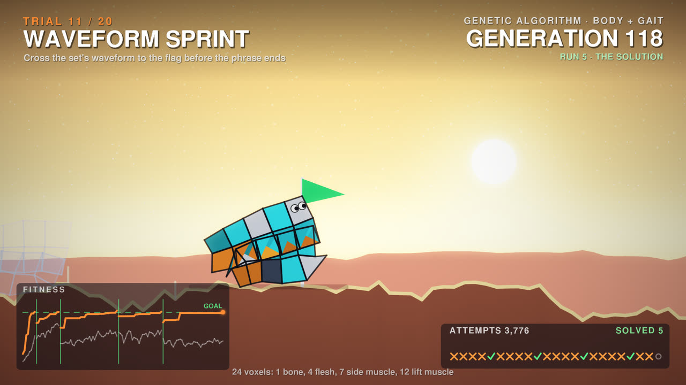
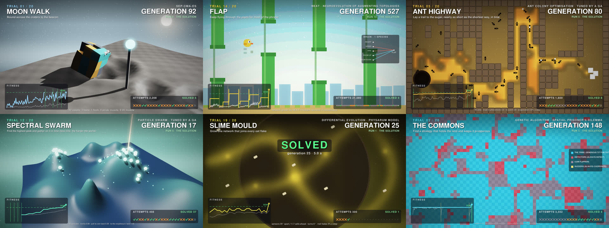

# crucible: twenty trials, evolved live

<p align="center"></p>

A tournament of twenty trials, each posed by a stretch of the set. In every trial a population of creatures (or a swarm, an ant colony, a slime mould, a tribe playing the prisoner's dilemma) evolves to beat it while you watch, under its own optimiser and its own physics: genetic algorithms, CMA-ES, CMA-ME (MAP-Elites), NEAT, Q-learning, SARSA, novelty search, ant colony optimisation, particle swarms, self-play, the cross-entropy method, parallel tempering and more, in 2D, 3D, pixel art and on grids. Nothing is staged: all that is designed is the world and how fitness is measured. The creatures fail because the world is hard (flipped over, crushed, egg broken, overshot the pad, overrun by defectors), and succeed when evolution finds a way.

The evolution runs at render time. Every new render is a new run, so even the same set gives different creatures, failures and solutions; a stopped render resumes its own run, and the receipt records the run's number so you can see it again.

```bash
setrender render set.wav -t crucible
setrender reel   set.wav -t crucible --phone
setrender render set.wav -t crucible --set evolution.run=482913   # replay a run from its receipt
```

<p align="center"><br>
<sub>Six of the twenty trials, from the Knisper set (frames identical to the full render).</sub></p>

## How a trial plays out

Each trial is a chapter of a few minutes (the set is split on downbeats into up to twenty). It opens with a **reveal**: the world and its rules on a card, with the hazards already running to the music. Then come **rounds** of eight bars (four for the quickest games), one attempt each, filled by the evolution as it happens:

- **A journey to success.** A run evolves until something meets the goal in the music of the round where its success will be shown. It is shown as five rounds: the best of its first generation, two from the middle, the generation just before success, then the success. About 80% of the screen time goes to journeys like these.
- **A harder world.** After a success the next run carries on with the same population in a harder version of the world. A world solved within a handful of generations was too easy, so it is made harder before anything is shown.
- **A dead end.** A run that reaches its last generation without success is shown the same way (its first generation, three from the middle, and its last, in the round it never passed), then it resets with a fresh population on a slightly easier world (as the environments in POET do when nothing can solve them). About 20% of the screen time.

The overlay shows the trial, the optimiser and the generation, the run and what it is (an ancestor, the solution, a dead end), a fitness chart that grows as you go (green lines where the world got harder, amber where a run reset), the tally of the rounds (✓ solutions, amber ✗ ancestors on the way to one, grey ✗ attempts in dead ends) and a stamp naming what happened. Every trial is solved at least once, usually several times. Every round replays the real best individual of the generation it names, in that round's own music, with a few of its siblings as ghosts.

Where a reference open-source implementation exists it is the one used: CMA-ES is Hansen's [pycma](https://github.com/CMA-ES/pycma), MAP-Elites with CMA-ES emitters (CMA-ME) is [pyribs](https://pyribs.org), NEAT is [neat-python](https://github.com/CodeReclaimers/neat-python), and the genetic algorithms use [DEAP](https://github.com/DEAP/deap)'s operators. The rest follow their papers (OpenAI-ES, differential evolution, the cross-entropy method, parallel tempering, ALPS, novelty search, the (μ, λ) evolution strategy, Q-learning, SARSA, ant colony optimisation, particle swarm optimisation).

## The twenty trials

The music decides which stretch gets which trial: every stretch's energy, low end, brightness, percussion, vocals, key, drops and breakdowns are matched against what each trial likes (a race for driving stretches, the prisoner's dilemma where there are voices, the moon in the quiet), and the best overall fit is used, so the order changes from set to set.

| Trial | World | Optimiser | What the music does |
|---|---|---|---|
| `sprint` WAVEFORM SPRINT | 2D soft-bodied voxel creatures (bone, flesh and two kinds of muscle) race across a desert | genetic algorithm (DEAP) evolving body and gait together | the ground is the stretch's loudness curve; muscles beat with the beat |
| `canyon` BASS CANYON | a gap to cross at night | CMA-ES (pycma) | the gap is wider when the low end is heavier |
| `boulders` BOULDER STORM | reach the cave under a rolling barrage | age-layered GA (ALPS) | a rock lands on the kick (every kick at the hardest), with a warning ring a beat before, and shatters |
| `stairway` SPECTRUM STAIRS | climb a staircase | CMA-ME through pyribs (MAP-Elites' archive of the best climber for each body shape, shown on screen, filled by CMA-ES emitters) | the steps are cut from the spectrum |
| `courier` EGG COURIER | carry an egg to the nest | parallel tempering | bumps in the road on the snares |
| `swim` DEEP CURRENT | swim upstream past jellyfish | (μ, λ) evolution strategy | the current follows the bass |
| `sumo` SUMO RING | push this generation's champion off a ring | self-play against a hall of fame | both wrestlers move to the beat |
| `moonwalk` MOON WALK | 3D creatures on the moon, a sixth of earth's gravity | sep-CMA-ES (pycma) | craters from the bass hits |
| `summit` SPECTRUM SUMMIT | 3D creatures climb a mountain | island-model GA | the mountain is the stretch's spectrogram |
| `swarm` SPECTRAL SWARM | a particle swarm searches a 3D landscape for its highest peak | particle swarm optimisation, its coefficients bred by a GA | the landscape is the spectrum; one swarm step every eighth note |
| `flock` MURMURATION | a 3D flock (boids) crosses a valley to the roost | OpenAI evolution strategies | hawks dive on the snares |
| `ants` ANT HIGHWAY | an ant colony lays a pheromone trail to the sugar | ant colony optimisation, the colony tuned by a GA | the maze comes from the onsets; a wall slides on the drop |
| `flap` FLAP | a puffball flaps through pipes (pixel art) | NEAT through neat-python (the growing network is drawn on screen) | a pipe every two beats, its gap following the treble |
| `snake` SNAKE CHARMER | grow the snake (pixel art) | Q-learning | one step every quarter beat |
| `maze` DECEPTIVE MAZE | a robot with range finders (pixel art) | novelty search (its archive of places is drawn) | the maze is cut from the music |
| `crossing` RUSH HOUR | hop across traffic (pixel art) | SARSA | trucks set off on the kicks, cars on the snares, bikes on the hats, vans on the bass |
| `platform` BEAT RUNNER | a platformer (pixel art) | GA evolving the button presses | pits on the kicks, ledges on the melody, spikes on the hats |
| `lander` SOFT LANDING | land a rocket on a vector screen | cross-entropy method tuning an autopilot | mountains from the loudness, gravity from the sub, gusts on the hats |
| `commons` THE COMMONS | the spatial prisoner's dilemma: each beat every cell copies its most successful neighbour | GA searching memory-one strategies (named on screen: tit for tat, win-stay lose-shift...) | the temptation to defect and the noise grow with the energy; invaders arrive on bars and drops |
| `slime` SLIME MOULD | thousands of Physarum agents grow a network between oat flakes | differential evolution | the flakes are scattered by the music |

Every character, creature and game here is original; the games are nods to their genres, not copies.

## How it follows the music

| The music | The picture |
|---|---|
| each stretch's character | which trial it gets, how hard it starts and how its world is built |
| the beat | the creatures' muscles (they walk to the beat), the swarm's and the snake's steps, the pipes |
| the kick | a lift in exposure (most in the shadows), rocks, trucks, pits |
| snares and hats | hawks' dives, cars and bikes, gusts of wind, spikes, bumps |
| loudness | the creatures' muscle power |
| drops | the first success when one is near, walls that move, invaders |
| sub | the floor glow along the horizon |
| bass | the accent light behind the scene, the current |
| low mids | the drift of the motes in the air |
| high mids | the motes' brightness |
| highs | sparkles and stars |

The set opens on a board listing the twenty trials in the order the music picked, and ends on the hall of champions: how often each trial was solved, and the run's totals.

## Keywords

| Keyword | What it does |
|---|---|
| `calm` | a softer kick pump |
| `vivid` | more saturation |
| `short` | more, shorter trials (from 1.5 minutes) |
| `long` | twelve longer trials |
| `walkers` | only the soft-bodied creature trials (2D and 3D) |
| `pixel` | only the five pixel-art games |
| `swarms` | the swarm, the flock, the ants and the slime mould |
| `games` | the games, the lander, the commons and sumo |
| `threed` | only the 3D trials |

## Things you can change with `--set`

From [`templates/crucible.tpl`](../../templates/crucible.tpl):

```bash
--set evolution.run=482913           # replay a run (its number is in the render's receipt)
--set "trials=[sprint, flap, commons]"   # pick the trials (the set's chapters cycle through them)
--set chapters=10                    # at most ten trials
--set chapter_minutes=4              # each at least four minutes
--set pulse.exposure=0.04            # a softer kick pump
```

## Rendering it

The evolution happens before the frames, once per render, in a few processes within the CPU budget (about ten minutes for a 2-hour set on an M1 Pro), and is cached in `SETRENDER_CACHE`, so a stopped render picks up the same run and a slice only evolves the trials it shows. Frames are then drawn on the GPU (WebGPU on Metal): lit 3D meshes with shadows, 2D shapes and pixel art scaled up by whole pixels, the overlay laid over the graded picture, and the frame converted to YUV on the GPU. A slice draws exactly the frames the full render of the same run has at those times.
