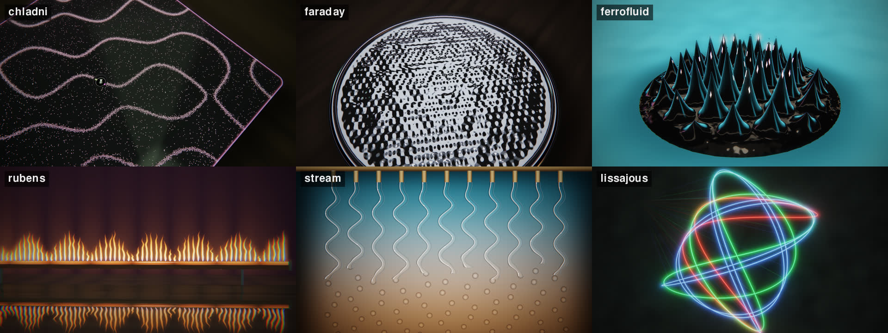

# cymatics: sound made visible

<p align="center"></p>

A physics lab at night where every experiment is played by the set, filmed like macro photography: a thin plane of focus, dark surroundings and a slow camera circling the bench. Sand gathers on the nodal lines of a Chladni plate, Faraday waves flip in a dish on every beat, ferrofluid grows spikes with the bass, a Rubens tube's flames stand in waves, water streams freeze into sine waves under a strobe, and lasers draw the chord of the key as Lissajous figures on the wall. The key's root note and its harmonics set every experiment's mode, builds sweep the drive up an octave, drops overdrive it, breakdowns let it rest, and each section moves to the next station with a rack focus.

```bash
setrender render set.wav -t cymatics
setrender reel   set.wav -t cymatics --phone
```

<p align="center"><br>
<sub>The six stations, from the Knisper set (frames identical to the full render).</sub></p>

## The six stations

Each section of the set gets one, for at least 16 bars, and the same station never comes twice in a row. A section that starts sooner gets a new mode instead.

| Station | What you see | The physics |
|---|---|---|
| `chladni` | a square or round plate dusted with sand, bolted to a driver at its centre; the sand gathers into lines | the sand is thrown off the vibrating parts and settles on the nodal lines, where the plate stands still. The mode comes from Chladni's law: frequency grows with the square of the nodal lines (n² + m² on a square plate, (m + 2n)² on a round one), and the two nearest modes ring together |
| `faraday` | a dish of ink, ink under coloured gels, or liquid metal, its surface a lattice of standing waves | Faraday waves: a vibrating liquid answers at half the drive frequency, so its pattern flips on every beat; squares, hexagons and 8, 10 and 12-fold quasicrystals, with the wavelength set by the capillary law (k ∝ f^2/3) |
| `ferrofluid` | a black mirror-glossy pool on a white plate, a dark mirror or a coloured light table, growing spikes | the Rosensweig instability: in a strong enough field the fluid's surface breaks into spikes on a hexagonal lattice (or rings), strongest over the magnet's centre |
| `rubens` | a long brass, copper or steel tube with a row of flames, reflected in the bench | a speaker at one end sets up a standing wave in the gas, and the flames burn tall at the pressure antinodes; some sections play the spectrum along the tube or send pressure pulses down it on the kick |
| `stream` | a curtain of water streams falling from a manifold, frozen into sine waves or helices, breaking into droplets | a speaker shakes the hose at nearly the strobe's rate, so the stream looks still and slips slowly; at the bottom it necks and breaks into beads (the Plateau–Rayleigh instability) |
| `lissajous` | three laser figures on a plaster wall, fanned through haze from a projector below | each laser bounces off a mirror on a vibrating membrane; its ratio against the root draws the chord: the root (a circle), the fifth (2:3) and the major or minor third (4:5 or 5:6), with the octave, fourth and sixth on higher harmonics |

Every station has its own materials, framings (a wide shot or a close-up with a shallow depth of field) and lights, picked per section from the set's own seed.

## The key sets the resonance

The shared analysis detects the key (as a Camelot code) through the set. Every phrase drives its experiment at a harmonic (1 to 6) of the root of the key detected most often in that phrase, from A1 (55 Hz) to G#2. The drive frequency sets the mode: a plate's nodal lines, the dish's wavelength, the spacing of the ferrofluid's spikes, the number of half-waves along the flame tube, the streams' wavelength and the lasers' chord. When the key moves or a new phrase picks a new harmonic, the sand (or the liquid, the spikes, the flames) re-forms into the new pattern over a bar and a half.

## How it follows the music

| The music | The picture |
|---|---|
| the kick | the experiment jolts (sand hops, the dish flips, spikes jump, flames leap, the streams slip a quarter wave, the figures pump), a lift in exposure and a small turn of the camera |
| sub-bass | the drive's amplitude: how far the sand bounces, wave height, spike height, flame height, the streams' swing, the figures' size |
| bass | the coloured accent light (and the lasers' glow) |
| low mids | the camera's orbit, the lattice's turn, the streams' slip, the figures' phase drift |
| high mids | fine detail: sand fizzing on the lines, capillary ripples, the ferrofluid's shiver, flame flicker, streams breaking into beads sooner |
| hi-hats | glints on sand grains, spray off wave crests, spike tips and droplets, sparkles in the laser haze |
| loudness | how fast everything moves; silence is nearly still |
| phrases | a new harmonic of the root (or a new root when the key moves): the pattern re-forms |
| sections | the next station, with a rack focus on the downbeat (a hard cut when a drop lands there) |
| builds | the drive sweeps up an octave: finer patterns, more spikes, more waves |
| drops | overdrive: the sand leaps and lands in a new pattern, the dish goes choppy, the spikes shoot up, the flames roar, the streams shatter into hanging beads, the figures spin into 3D |
| breakdowns | the experiment comes to rest: still sand, glassy liquid, a mirror-smooth puddle, low even flames |

The set opens with the lights coming up as the first experiment switches on, and ends with the drive stopping and the lights going down.

## Keywords

| Keyword | What it does |
|---|---|
| `calm` | a gentler kick pump, a slower orbit and smaller camera turns |
| `sharp` / `dreamy` | everything in focus, or a shallower focus with more bloom |
| `gentle` | a softer kick pump and fewer lens fringes |
| `vivid` | more saturation |
| `plates` | only the plate, the dish and the ferrofluid |
| `light` | only the flames, the streams and the lasers |
| `chladni`, `faraday`, `ferrofluid`, `rubens`, `stream`, `lissajous` | one station all night |
| `ink`, `gels`, `mercury` | the Faraday dish holds only ink, ink under coloured gels, or liquid metal |

## Things you can change with `--set`

From [`templates/cymatics.tpl`](../../templates/cymatics.tpl):

```bash
--set "stations=[chladni, ferrofluid, lissajous]"   # pick the stations
--set min_bars=32                    # keep each station longer
--set drive.harmonics=4              # lower harmonics: simpler patterns
--set drive.settle_bars=3            # the sand takes longer to settle
--set camera.orbit=0.06              # circle the bench faster
--set lens.depth_of_field=1.2        # a thinner plane of focus
--set "materials={chladni: 2, ferrofluid: 2}"   # golden sand; ferrofluid on a light table
--set pulse.exposure=0.04            # a softer kick pump
```

Materials by station: `chladni` 0 white sand on a black plate, 1 iron filings on brushed steel, 2 golden sand, 3 salt on a deep blue plate; `faraday` 0 ink, 1 ink under coloured gels, 2 liquid metal; `ferrofluid` 0 on a white plate, 1 on a dark mirror, 2 on a light table; `rubens` 0 brass, 1 copper, 2 steel; `stream` 0 a coloured lightbox, 1 a dark room, 2 a grid behind the water; `lissajous` 0 red, green and blue lasers, 1 a green scope, 2 warm lasers.

## Photosensitivity

The kick lifts the exposure by 10% and the shadows by up to 25% more, never the highlights; the bass lights large areas (the light table, the backlight) with a gentle rise and fall; and drops scatter, splash and flare rather than flash. The automated checks count flashes over the whole render against the Harding and WCAG thresholds (no more than three a second). For an even gentler video use `-k gentle`.

## Highlight reels

`setrender reel <audio> -t cymatics` cuts about 30 s of whole-beat clips, opening on the lights coming up and closing on them going down, with the clips in between spread evenly through the set at its drops, new stations and new harmonics. `--phone` adds a 720p copy.

## Under the hood

| Stage | Tool | Notes |
|---|---|---|
| Plan | NumPy and the shared analysis | the whole set is planned up front: a station per section (at least 16 bars), a mode per phrase from the key's root and a harmonic, drops, builds and breakdowns, and the camera's orbit, its turns on the kick and an animation clock integrated over the set |
| Drawing | wgpu (WebGPU, Metal backend) | one full-screen WGSL shader per frame at the output resolution: the plate's sand as grains in cells (melting into a density where they are smaller than a pixel), the dish as analytic standing waves, the ferrofluid ray-marched as a height field, the flames and streams in a plane with a perspective camera, and the Lissajous figures by solving for where each curve crosses the pixel's row and refining with Newton steps; a studio of softboxes, a ring light and coloured strips lights every reflection |
| Finish | WGSL | the canvas keeps each pixel's circle of confusion; a quarter-size blur gives the depth of field, the rack focus and the bloom; then lens fringes, an exposure lift, a filmic tone curve, saturation, a vignette and BT.709 NV12 with dither, all on the GPU |
| Encode | VideoToolbox | ffmpeg only encodes; sand grains and glints are costly, so the template asks for q42 (looks the same as q52 at about half the size) |

It renders at about 2.1x real time with two jobs (`--cpu 6`, about 55 minutes for a 2 h set at a load of about 4 to 6) and about 5 GB per 2 h (the dark lab compresses well; sand plates are the costliest stretches). Slices are drawn in absolute set time, so `--start/--duration` gives exactly the frames of the full render.

**What "done" means for cymatics:** [CRITERIA-cymatics.md](../criteria/CRITERIA-cymatics.md), with results in [CRITERIA_REPORT-cymatics.md](../criteria/CRITERIA_REPORT-cymatics.md).
