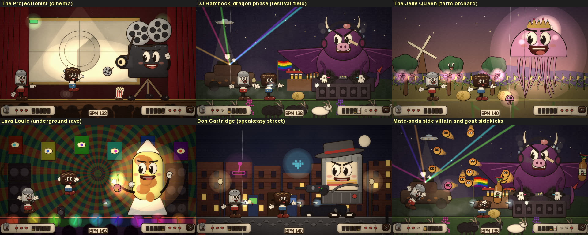
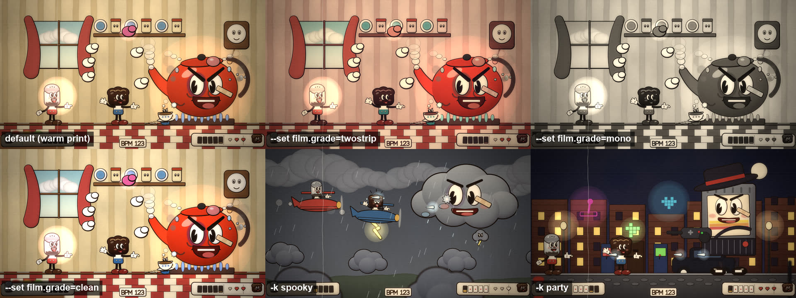

# rubberhose: a 1930s cartoon boss rush

<p align="center"></p>

A 1930s rubber-hose cartoon boss rush in the spirit of Cuphead, with original characters. Each act of your set is one boss fight: two heroes lose a take or two (three hearts each, ghosts the partner can parry back to life, a TAKE card and a restart) before the KNOCKOUT. Super cards fill from damage and parries for EX shots and Super Arts, long breakdowns become intermissions (a bouncing-ball sing-along, the overworld map, a vaudeville number), drops land with a super attack, an easter egg turns up every minute, and everything on screen bounces on the kick. It is shot through a warm film print with grain, dust, scratches, gate weave and flicker.

```bash
setrender render set.wav -t rubberhose
setrender reel   set.wav -t rubberhose --per-act --length 30 --phone
```

<p align="center"></p>

## The cast

The heroes are two kitchen mascots (a pepper shaker, a rye loaf, a salt shaker, a light bulb or a sugar bowl). A set title that names one of them casts it: "pepper", "pumpernick", "rye", "bread", "salt", "sugar", "light", "lamp" and a few others are recognised, so `--title "Salt & Sugar live"` stars the salt shaker and the sugar bowl. Otherwise the set's seed picks a pair.

<p align="center"><br>
<sub>Six of the thirteen bosses.</sub></p>

The thirteen bosses are a gramophone in a ballroom, a sun and a storm cloud fought in biplanes, a kettle in a kitchen, a pipe organ in a graveyard whose pipes are a spectrum, an octopus at sea, a jukebox robot on a rooftop whose neon tubes are a spectrum, an old oak in the forest, the Jelly Queen over a farm orchard with jellyfish hanging in the trees, DJ Hamhock (a purple hog on the decks who turns into a dragon for the last phase) on a festival field with a burned-out car DJ booth, lasers, a smoke machine, pride flags, hay bales, a bar pouring German beer and mate soda and a crowd of goats, black sheep and pixel stick men, Lava Louie in a psychedelic underground rave, Don Cartridge (a mob-boss game cartridge with a joypad tommy gun) in a speakeasy street of arcade cabinets, and the Projectionist, who fights from the cinema stage in front of a countdown leader and burns holes through the film when it changes phase. A cheeky bottle of mate soda (a parody mascot) is a side villain who turns up among everyone's sidekicks.

## How a fight plays

Each act is one boss, beaten exactly once. Most fights take a retake or two: each hero has three hearts, a boss shot that lands costs one (the hero is knocked back and blinks, untouchable, for a moment), and at zero the hero drops while their pink ghost floats up. The partner can run under it and parry it to bring them back with one heart; if nobody does, the ghost floats off and leaves a little headstone. When both are down the boss laughs, a TAKE card's clapperboard slams on the downbeat with a strip of film showing how far they got, and the fight restarts from READY? with the boss fresh.

Each hero's five super cards fill from damage dealt and parries: one card throws an EX (a peppercorn bomb, a rye slice, a salt crystal, a bolt, a sugar cube), and a full hand is never spent on an EX: it fires a Super Art (a Sneeze Beam, a giant spirit belly-flop or a Bright Idea flash) on the next drop or big downbeat and spends all five.

Fights are fierce: two to five shots a bar plus a barrage on every drop, five-way spreads late on, sidekicks in most bars, and most bosses take two or three takes to beat. Every boss has sidekicks that join in more as the fight goes on: runners along the floor that the heroes hop (one after the other, if it carries on into the partner), flyers that swoop in at head height and have to be ducked, and poppers that crack the floor for two beats and burst up under a hero, who dashes clear. They can land hits, and the ones that don't get through are popped by the peashooters and tumble away dazed: walking records and winged quavers (gramophone), fire imps (sun), storm puffs (cloud), teacups and a boxing mouse (kettle), bats and grave hands (organ), crabs and flying fish (octopus), rolling nickels and winged 45s (jukebox), toadstools, bees and a mole (oak).

Shots and sidekicks are planned to skim heads and land at toes, about 2,500 near misses a set; the heroes flinch with shock lines and sweat, and the very closest get a YIKES!, PHEW!, WHOA!, CLOSE ONE! or HOO BOY!. A pink parry can be mistimed (the hero jumps too soon and comes down into it, losing a heart); a good one sends a whole card flying to the HUD. Hearts float through on little wings now and then: the hurt hero leaps for them, sometimes high, and they are grabbed, missed by a whisker, or snatched by a sidekick at the last moment.

Bosses wear the damage of the take: plasters, a black eye, a bump, sweat, then smoke from the ears, plus their own: the kettle heats from teal to glowing red, organ pipes snap, the jukebox's neon dies tube by tube, the oak drops its leaves, the octopus gets bandaged, the cloud tears and drizzles, the sun gets sunspots.

All of it is planned on the music's clock: every boss shot is fired on a beat in a bar where the kick plays, the heroes' peashooters fire on the 8th or 16th-note grid only while the hi-hats are busy, every hit lands on a beat, and every Super Art starts on a drop.

## Things to look out for

A jazz horn that pops in when the classifier hears brass, a candlestick phone on ringtones, a black cat on a meow, a skeleton playing its ribs on xylophones (and at bar 1929, for The Skeleton Dance), a steamboat on a foghorn (and at bar 1928, for Steamboat Willie), a stork when a baby cries, a ghost on a theremin, a record being scratched, the audience cheering, the boss laughing, and a film burn at bar 404.

On top of those, an easter egg turns up about once a minute (26 kinds, none twice within ten minutes): a cream pie in the boss's face, an anvil, the animator's pencil drawing on a moustache, a bomb bounced back at the boss, a fly on the projector lens, a hand-shadow rabbit or dog from the audience, the film slipping a frame, pride-flag balloons, a UFO after a cow and the burned-out DJ car (nods to the other templates), a jellyfish, an acid smiley, a mirror ball, a cassette and a pencil, an 8-bit invader, the Konami code, a walking metronome, a cuckoo clock, a paper aeroplane, a hot-air balloon band, a bat with a glowstick, a stagehand with a ladder, a green pipe, a ? block to bump, a bowling ball to hop and a banana peel.

## Keywords and film grades

<p align="center"><br>
<sub>The same moment in four film grades with <code>--set film.grade=...</code>, which changes only the grade. Keywords also reshuffle the running order, so <code>-k spooky</code> and <code>-k party</code> show different bosses at that moment.</sub></p>

| Keyword | What it does |
|---|---|
| `twostrip` | a two-strip Technicolor-style grade (reds and cyans) |
| `mono` | black-and-white film |
| `clean` | a neutral grade with no grain, dust or scratches |
| `pristine` | keeps the warm grade but removes dust, hairs and scratches |
| `steady` | no line boil (the hand-inked wobble between drawings) |
| `nohud` | no hearts, cards or BPM on screen |
| `short` / `long` | acts of about 6 or 15 minutes (8 by default) |
| `frantic` / `chill` | 1.6x or 0.6x as many boss attacks |
| `classic` | the first eight bosses only |
| `party` | the five newest bosses: Jelly Queen, DJ Hamhock, Lava Louie, Don Cartridge, the Projectionist |
| `sky` | only the sun and the storm cloud, in biplanes |
| `spooky` | the organ, the storm cloud and the octopus |
| `flawless` | every boss beaten in the first take |
| `hardcore` | more lost takes |
| `nosidekicks` | bosses fight alone |

Acts aim for `story.act_minutes` (8 by default) but are capped at one per boss in the pool, so each boss is beaten exactly once and a smaller pool means longer acts. Only when that would stretch acts past 2.2 times their target (a long set with `sky`, say) do bosses come back for rematches.

## Things you can change with `--set`

From [`templates/rubberhose.tpl`](../../templates/rubberhose.tpl):

```bash
--set "bosses=[kettle, hamhock, projectionist]"   # pick and order the bosses
--set story.act_minutes=10            # target act length
--set story.attack_rate=1.3           # boss shots per bar, relative
--set "story.retake_weights=[0, 0, 1, 0]"   # aim for two lost takes in every fight
--set film.grain=0.08 --set film.dirt=0.5 --set film.vignette=0.6
--set film.kick_pump=0.12             # stronger projector flash on the kick
--set boil=0.5                        # calmer line boil
```

Boss names: `gramophone`, `sun`, `cloud`, `kettle`, `organ`, `octopus`, `jukebox`, `oak`, `jelly`, `hamhock`, `lava`, `don`, `projectionist`.

## Highlight reels

`setrender reel <audio> -t rubberhose` cuts about 30 s of whole-beat clips (10 to 15 clips of 2 to 3 s), opening on the title card and closing on THE END, with the clips in between spread evenly through the set at its most salient moments: supers, knockouts, gags, drops and section starts. `--per-act` cuts one clip per boss instead, each on that fight's best moment (a Super Art, the knockout, a save, a lost take's TAKE card or a transformation, varied from boss to boss), plus a map walk and an intermission, in set order: `--length 30` gives 15 clips of about 2 s and `--length 120` about 8 s each, every cut on a beat. `--phone` adds a 720p copy for social media.

## Under the hood

| Stage | Tool | Notes |
|---|---|---|
| Running order | NumPy, the shared analysis and the cropcircle sound classifier (Core ML, Neural Engine capable) | the whole set is planned up front: one act per boss cut at section starts, each played as takes (lost takes restart at a section change, the last is won), three boss phases, READY?/GO!/TAKE n/KNOCKOUT! cards, intermissions from long breakdowns, gags cued by sounds and an easter egg a minute |
| Combat | NumPy (`hose/combat.py`) | Cuphead's rules on the music's clock: boss shots and sidekicks fired on beats and aimed by role (a hit, a dodge the hero hops, ducks or dashes, a pink shot to parry or a parry mistimed, a near miss that skims a head or lands at the toes, a sidekick popped by the peashooters), every path checked against both heroes; 3 HP each, floating hearts, ghosts the partner can parry back to life, five super cards filled by damage and parries, EX shots for one card and Super Arts for all five on drops |
| Drawing | wgpu (WebGPU, Metal backend) | every shape is a signed-distance primitive on an instanced quad (ellipses, tapered capsules, quadratic hose curves, pie-cut pupils, stars, arcs, hearts, sunbursts, waves), with shared outlines, ink that is heavier on the shadow side, cel shading, watercolour washes for backgrounds, and line boil that changes with every drawing |
| Timing | | characters are drawn on a 24-drawings-per-second clock, as in 1930s cartoons and Cuphead, re-phased so a new drawing always lands on the beat; the camera and shots move at 60 fps |
| Film | WGSL | gate weave, flicker with a kick pump, grain at 24 fps, dust, hairs and scratches, halation, soft focus, vignette, iris transitions, a warm print grade (or `twostrip`, `mono`, `clean`) |
| Encode | GPU, then NV12, then VideoToolbox | frames are converted to BT.709 NV12 on the GPU, so ffmpeg only encodes |

It renders at about 1.45x real time with two jobs (`--cpu 6`, about 80 minutes for a 2 h set at a load of 4 to 6) and about 10 GB per 2 h; the latest full render of the trimmed Knisper set took 64.5 minutes. Slices are drawn in absolute set time, so `--start/--duration` gives exactly the frames of the full render, which makes previews and reels cheap.

**What "done" means for rubberhose:** [CRITERIA-rubberhose.md](../criteria/CRITERIA-rubberhose.md), with results in [CRITERIA_REPORT-rubberhose.md](../criteria/CRITERIA_REPORT-rubberhose.md).
