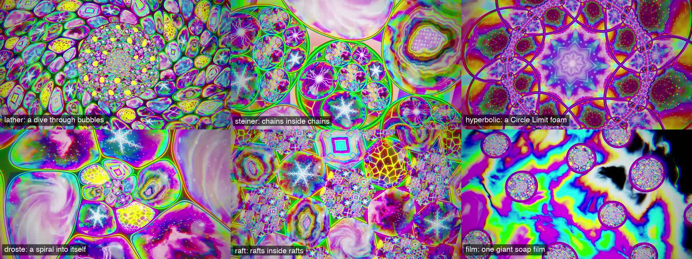

# spume: alien foam, falling forever into itself

<p align="center"></p>

Patterns only: no characters, no letters. An alien depiction of foam in all its twisted forms, drawn by one shader on the GPU. Bubbles sit inside bubbles inside bubbles and the camera dives through them without end; their soap films take the endless colours of real thin-film interference, kaleidoscopes fade in and out with the phrases, and every bubble is a lens into one of the earth's elements, alternating from cell to cell: fire, water, earth, air, metal, ice, lightning and magma. Drops pop the bubble, instruments the on-device classifier hears become elements, and the light takes the colour of the key.

```bash
setrender render set.wav -t spume
setrender reel   set.wav -t spume --phone
```

<p align="center"><br>
<sub>The six motifs, from the full render of the Knisper set.</sub></p>

## The six motifs

Each section of the set gets one, arriving in a new bubble that inflates on the downbeat and swallows the screen. Long sections change every couple of minutes, and the same motif never comes twice in a row.

| Motif | What you see | The recursion |
|---|---|---|
| `lather` | a foam of bubbles of every size pressed together around one big bubble | the big bubble holds another foam with its own big bubble, and the camera dives into it forever |
| `steiner` | rings of bubbles (Steiner chains) turning like gears, a step on every kick | every ring sits inside a bubble, and every third bubble holds a ring of its own |
| `hyperbolic` | a foam in the Poincaré disk, its cells shrinking to infinity at the rim, like Escher's Circle Limit | the dive slides the foam across the hyperbolic plane, two cells at a time |
| `droste` | a spiral of bubbles winding into the centre, each turn smaller | the picture contains itself, turn after turn |
| `raft` | a hexagonal bubble raft, one cell in three a window | each window holds a smaller raft, three rafts deep |
| `film` | one giant soap film, swirling, draining to black at the top, with lenses of foam drifting up through it | each lens holds a diving lather of its own |

Breakdowns of 16 bars or more drift into the giant film, and every breakdown slows the dive to a crawl while its build winds the vortex tighter and pushes the colour up, until the drop pops the bubble.

## The eight elements

Every bubble is a lens into one element, seen through its dome (magnified in the middle, darker at the rim) and under its soap film. Neighbouring bubbles never hold the same element.

| Element | Drawn as |
|---|---|
| fire | flame tongues rising off a dark ground, a blue base and embers |
| water | the caustic net of light on a pool floor, with ripples |
| earth | agate: warped bands round a hollow lined with amethyst crystals |
| air | a dusk sky swirling into a vortex, clouds and wind streaks |
| metal | bismuth: hopper crystals stepping down in terraces, each a different colour of its oxide skin |
| ice | frost: six-fold dendrites, branches on branches |
| lightning | a plasma globe: filaments from the core to the glass |
| magma | cooling crust: dark plates with glowing seams |

## How it follows the music

| The music | The picture |
|---|---|
| the kick | a brightness pump, a punch of zoom and a turn of the camera on every beat |
| sub-bass | the soap films show more strongly and thicken, so their colours roll |
| bass | the neon in the Plateau borders (the dark lead between the bubbles) lights up |
| low mids | how fast the films swirl |
| high mids | how fiercely the elements burn: flames, lightning, caustics, magma seams |
| hi-hats | sparkle on the films and fizz rising inside the bubbles |
| loudness | how fast everything moves; silence is nearly still |
| phrases | kaleidoscopes fade in and out (3 to 12 folds), the elements trade places |
| sections | a new motif and palette, arriving in an inflating bubble |
| drops | the bubble pops: a flash and a ring of film colour, and a fresh arrangement |
| breakdowns and builds | the dive slows; the vortex winds up and the colour saturates towards the drop |
| the key | the colour of the light, around the circle of fifths (Camelot number to hue) |
| instruments | element surges: brass to fire, keys and mallets to water, hand drums to earth, flutes and voices to air, bells and cymbals to metal, strings to ice, theremins to lightning, organs to magma |

The surges come from Apple's on-device sound classifier (Core ML, Neural Engine capable), the same one the other GPU templates use: when it hears an instrument, that element's bubbles swell and blaze for a few bars.

## Keywords

| Keyword | What it does |
|---|---|
| `calm` / `frantic` | a slower or faster dive, fewer or more kaleidoscopes |
| `mirror` / `nomirror` | kaleidoscopes nearly always, or never |
| `acid` | more saturation, stronger films, wider palette shifts between sets |
| `physical` | the films' true colours: no extra saturation, white light |
| `gentle` | a softer kick pump, no zoom punch and fewer prism fringes |
| `thin` / `thick` | thinner films (golds and magentas) or thicker ones (greens and pinks) |
| `bubbles` | only the lather, Steiner chains and the giant film |
| `infinite` | only the hyperbolic foam, the Droste spiral and the raft |
| `lather`, `steiner`, `hyperbolic`, `droste`, `raft` | one motif all night |
| `nosurges` | instruments don't cue the elements |

## Things you can change with `--set`

From [`templates/spume.tpl`](../../templates/spume.tpl):

```bash
--set "motifs=[steiner, hyperbolic]"   # pick the motifs
--set dive.levels_per_bar=0.2          # dive faster (scaled by the music's energy)
--set kaleidoscope.share=0.8 --set "kaleidoscope.folds=[6, 8]"
--set twist=1.2                        # a tighter vortex
--set film.thickness=350 --set film.strength=1.3
--set colour.saturation=1.4 --set colour.key_light=0   # white light
--set pulse.exposure=0.08              # a softer kick pump
```

## Photosensitivity

Psychedelic video can be hard on viewers with photosensitive epilepsy. spume keeps its full-screen pulses to the kick (well under three a second at club tempo) and the automated checks count flashes over the whole render against the Harding and WCAG thresholds. For an even gentler video use `-k gentle`.

## Highlight reels

`setrender reel <audio> -t spume` cuts about 30 s of whole-beat clips, opening on the first bubble forming out of the dark and closing on the last one collapsing and popping, with the clips in between spread evenly through the set at its pops, new motifs, kaleidoscopes and element surges. `--phone` adds a 720p copy.

## Under the hood

| Stage | Tool | Notes |
|---|---|---|
| Plan | NumPy, the shared analysis and the sound classifier | the whole set is planned up front: motif segments at sections (and every couple of minutes), kaleidoscope and element changes on phrases, pops on drops, the dive, the camera's turn, the films' swirl and an animation clock integrated over the set, surges cued by instruments, and the key's colour |
| Colour | NumPy (`spume/film.py`) | the soap film's reflectance at every visible wavelength (Airy's formula for a thin layer, n = 1.335) is lit by a blackbody illuminant and integrated against the CIE 1931 colour-matching functions; a second table does bismuth's oxide skin |
| Drawing | wgpu (WebGPU, Metal backend) | one full-screen WGSL shader per frame: the kaleidoscope fold, the vortex, the motif's recursion (power diagrams, Möbius maps, hyperbolic reflections, log-polar spirals, hex rafts), then each bubble's lens, element, film, highlight, sparkle and border; bubbles under a few pixels melt into their average colour so the recursion never turns to noise |
| Finish | WGSL | bloom, prism fringes, an exposure pump, a filmic tone curve, saturation, a vignette, then BT.709 NV12 with dither, all on the GPU |
| Encode | VideoToolbox | ffmpeg only encodes; every pixel moves every frame, so the template asks for q40 (about 20 Mbit/s), which looks the same as q54 here at about half the size |

It renders at about 1.75x real time with two jobs (`--cpu 6`, about 66 minutes for a 2 h set at a load of about 3 to 5) and about 17 GB per 2 h. Slices are drawn in absolute set time, so `--start/--duration` gives exactly the frames of the full render.

**What "done" means for spume:** [CRITERIA-spume.md](../criteria/CRITERIA-spume.md), with results in [CRITERIA_REPORT-spume.md](../criteria/CRITERIA_REPORT-spume.md).
